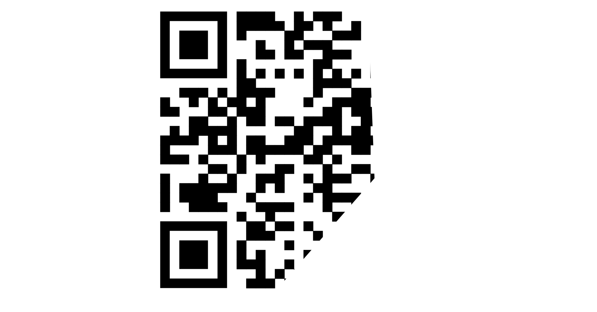

### Oliver och Tim 
---
## Den svunna QR-kodens skattjakt
---
## Besikrivning av uppgiften 
Vi har valt att göra en uppgift som är en sorts "skattjakt". Man ska lösa flera mindre utmaningar som sen leder till flaggan. Lös första uppgiften, för att få något som leder till nästa uppgift, och så vidare, tills man löst sista uppgiften och kan nå flaggan.  

 ## Detaljerad lösningsskiss
1. Man börjar med att få en bild på en trasig QR kod, ex:
    
   
    
2. Laga QR koden med valfri bild editor. I exemplet är det pixlr.com 

    
 

Markera en av hörnen och kopiera den så att tre hörn blir kompletta, då ska QR koden gå att använda och man kommer vidare till en github.

3. På githuben får man ladda ner prodjektet för att sedan kunna köra den. Följ stegen i readme filen för hur man ladda ner.
 
 
4. När du har startat upp hemsidan kommer du mötas av en bild som faktiskt är en gif. Om man ladar ner bilden och lägger in den i valfri gifsplitter så kommer man se att det gömmer sig en hemlig sökväg som finns på sidan.
 
 
5. skriver du in sökvägen kommer du till vår alien shop där det är dags för att köpa lite alienprylar. för att kunna det måste man gå in i cookies på sidan och ändra i money för att ha råd att köpa UFO:t 
 
 
6. När du har köpt UFO:t så kommer flaggan komma up i en lista under köpalternativen.
 
 
7. Grattis du har hittat flaggan!

## Uppskatad svårighetsnivå
Våran uppgift baseras på tidigare års uppgifter från säkerhets-sm och om man då har gjort någon/några av de uppgifterna kan man nog lösa våran uppgift ganska lätt. Svårigheten kommer mestadels från att flaggan ligger bakom ganska många steg. Man måste göra en sak för att få göra nästa sak, och så vidare för att till sist nå flaggan. Därför sätter vi svårighetsnivån på 0.7, antagligen kan det vara 1, men alla kanske inte orkar göra alla stegen.

## Flagga

210s{BreakingBadIsGood}

## reflektion 

Om man ser till hur vi planerade upgiften så har vi mestadels förljt våra planer. Det som ändrades var att vi inte kunde skapa en sida som kan vara uppe hela tiden som QR koden skulle leda till. Då fick QR koden istället leda till en github där man får ladda ner prodjektet och starta sidan localt för att lösa uppgiften. Utöver det så var de andra ändringarna eller skilnaderna mest bara stilen på bilder och layout. Som i den här övningen fick lite alien tema. 

